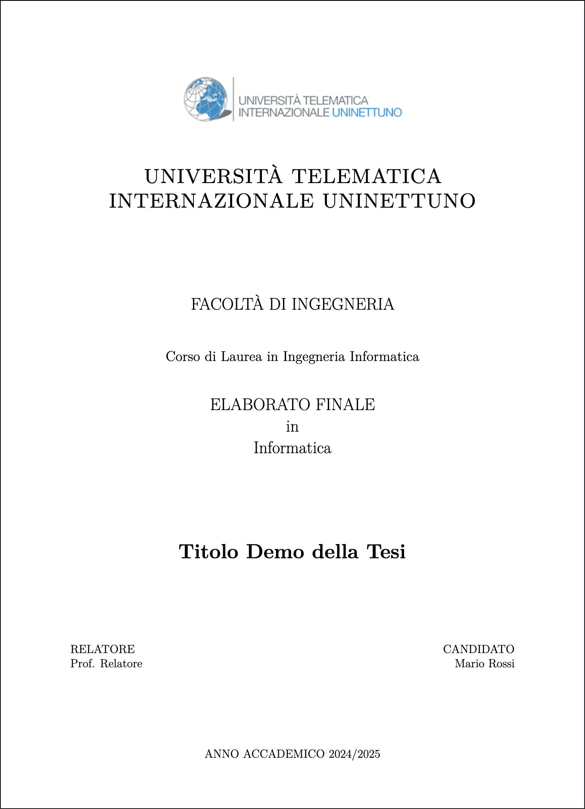

# 📚 Template LaTeX Tesi UNINETTUNO

[](https://opensource.org/licenses/MIT)
[](https://www.latex-project.org/)
[](https://github.com/features/actions)
[](https://www.uninettunouniversity.net/)
[](https://cursor.sh/)
[](https://github.com/riccardodicurti/template-latex-tesi-uninettuno)

Template LaTeX professionale per tesi triennali e magistrali dell'**Università Telematica Internazionale UNINETTUNO**, con particolare focus su Ingegneria Informatica.

Questo template è stato creato per semplificare la stesura della tesi, fornendo una struttura già configurata secondo le linee guida UNINETTUNO e best practices LaTeX.

---

## 📸 Anteprima

<div align="center">
  
  <p><em>Esempio di frontespizio generato dal template</em></p>
</div>

---

## ✨ Caratteristiche

- ✅ **Conforme alle linee guida UNINETTUNO** (margini, font, numerazione, struttura)
- 📁 **Struttura modulare** con capitoli separati per facile gestione
- 🎨 **Configurazione centralizzata** (metadati, pacchetti, layout)
- 🔄 **Sistema di build automatico** con hot-reload durante lo sviluppo
- 🎯 **Regole Cursor AI** pre-configurate per assistenza intelligente
- 📦 **Pacchetti LaTeX essenziali** già inclusi e configurati
- 🖼️ **Gestione immagini** organizzata per capitolo

---

## 📂 Struttura del Progetto

```
template-latex-tesi-uninettuno/
├── tesi.tex                    # File principale LaTeX
├── config/                     # Configurazioni
│   ├── metadata.tex           # Metadati (titolo, autore, relatore)
│   ├── packages.tex           # Pacchetti LaTeX
│   └── layout.tex             # Impostazioni di layout
├── chapters/                   # Capitoli della tesi
│   ├── 00-abstract.tex        # Abstract/Sommario
│   ├── 01-sommario.tex        # Sommario esteso
│   ├── 02-introduzione.tex    # Capitolo 1: Introduzione
│   ├── 03-*.tex               # Capitoli principali
│   ├── 07-conclusioni.tex     # Conclusioni
│   ├── 08-bibliografia.tex    # Bibliografia
│   ├── appendici.tex          # Appendici
│   └── ringraziamenti.tex     # Ringraziamenti
├── assets/                     # Immagini e risorse
│   ├── logo.png               # Logo università
│   └── 01-introduzione/       # Immagini per capitolo
├── .cursor/                    # Regole per Cursor AI
│   └── rules/                 # File .mdc con regole specifiche
├── build.js                    # Script di compilazione automatica
├── package.json               # Configurazione npm
└── README.md                  # Questo file
```

---

## 🚀 Quick Start

### 1️⃣ Clona la Repository

```bash
git clone https://github.com/tuousername/template-latex-tesi-uninettuno.git
cd template-latex-tesi-uninettuno
```

### 2️⃣ Personalizza i Metadati

Apri `config/metadata.tex` e modifica i tuoi dati:

```latex
\title{Il Tuo Titolo della Tesi}
\author{Il Tuo Nome \\ Matricola: TUAMATRICOLA \\ Corso di Laurea in ...}
\newcommand{\relatore}{Prof. Nome Cognome Relatore}
\newcommand{\candidato}{Il Tuo Nome}
\newcommand{\titolo}{Il Tuo Titolo della Tesi}
```

### 3️⃣ Aggiungi i Tuoi Contenuti

- **Capitoli**: Modifica i file in `chapters/` con i tuoi contenuti
- **Immagini**: Inserisci le immagini in `assets/` organizzate per capitolo
- **Bibliografia**: Aggiorna `chapters/08-bibliografia.tex` con le tue fonti

### 4️⃣ Compila la Tesi

Scegli uno dei metodi seguenti:

#### Metodo A: Sistema di Build Automatico (Raccomandato)

```bash
# Installa le dipendenze
npm install

# Modalità sviluppo con hot-reload
npm run dev

# Compilazione completa
npm run build

# Compila e apri il PDF
npm run pdf
```

#### Metodo B: Compilazione Manuale

```bash
pdflatex tesi.tex
pdflatex tesi.tex  # Seconda passata per riferimenti
pdflatex tesi.tex  # Terza passata per indice
```

#### Metodo C: Overleaf

1. Carica tutti i file su [Overleaf](https://www.overleaf.com)
2. Imposta `tesi.tex` come documento principale
3. Compila direttamente online

---

## 🛠️ Comandi npm Disponibili

| Comando | Descrizione |
|---------|-------------|
| `npm run dev` | Modalità sviluppo con ricompilazione automatica |
| `npm start` | Alias di `npm run dev` |
| `npm run build` | Compilazione completa (3 passaggi) |
| `npm run build:quick` | Compilazione rapida (1 passaggio) |
| `npm run pdf` | Compila e apre il PDF |
| `npm run clean` | Rimuove file temporanei LaTeX |
| `npm run clean:all` | Rimuove tutto incluso il PDF |
| `npm run help` | Mostra l'aiuto |

---

## 🤖 Integrazione con Cursor AI

Questo template include **regole pre-configurate** per [Cursor](https://cursor.sh/), un editor AI-powered che può assisterti nella scrittura della tesi. Le regole garantiscono che l'AI rispetti automaticamente le linee guida UNINETTUNO e gli standard accademici.

### 📚 Regole Disponibili (`.cursor/rules/`)

Il template include **4 regole professionali** già configurate e pronte all'uso:

#### 1. **`uninettuno-monografia.mdc`** - Linee Guida UNINETTUNO
Regole ufficiali per tesi triennali UNINETTUNO:
- ✅ Struttura obbligatoria (frontespizio, sommario, capitoli, bibliografia)
- ✅ Formattazione (A4, margini 2.5cm, Times New Roman 12pt, interlinea 1.5)
- ✅ Numerazione pagine e capitoli
- ✅ Figure e tabelle con didascalie corrette
- ✅ Citazioni in stile IEEE
- ✅ Dimensioni attese (50-70 pagine per triennale)

**Quando si attiva**: Sempre, su tutti i file `.tex`

#### 2. **`stile.mdc`** - Stile Accademico di Alto Livello
Regole per scrivere una tesi "da 110 e lode":
- ✅ Lingua italiana, terza persona, tono accademico
- ✅ Struttura dei paragrafi (tema → evidenze → ragionamento → conclusione)
- ✅ Citazioni corrette con `\cite{}` per tutto ciò che non è originale
- ✅ Terminologia coerente in tutto il documento
- ✅ Matematica, algoritmi e codice ben formattati
- ✅ Esperimenti riproducibili con setup dettagliato

**Quando si attiva**: Sempre, su tutti i file `.tex`

#### 3. **`citazioni.mdc`** - Gestione Bibliografia IEEE
Regole per citazioni e bibliografia corrette:
- ✅ Formato numerico `[n]` in stile IEEE
- ✅ Posizionamento corretto (dopo l'informazione, prima del punto)
- ✅ Creazione automatica di `\bibitem{}` mancanti
- ✅ Citazioni testuali con pagina (`\cite[p.~123]{chiave}`)
- ✅ Fonti nelle figure (`Fonte: \cite{chiave}`)
- ✅ Ordinamento per prima comparsa nel testo

**Quando si attiva**: Sempre, su tutti i file `.tex`

#### 4. **`latex.mdc`** - Best Practices LaTeX
Regole operative per l'AI e best practices:
- ✅ Modifiche in-place (non aggiunge in coda)
- ✅ Propagazione automatica delle modifiche (termini, rinvii, label)
- ✅ Gestione corretta di overfull hbox
- ✅ Coerenza tra sommario italiano e inglese
- ✅ Output come diff multi-file con changelog

**Quando si attiva**: Sempre, su tutti i file `.tex`

---

### 🎯 Come Usare con Cursor

#### Setup Iniziale
1. Scarica e installa [Cursor](https://cursor.sh/)
2. Apri il progetto template in Cursor
3. Le regole si attiveranno **automaticamente** sui file `.tex`
4. Inizia a scrivere o chiedi aiuto all'AI!

#### Esempi di Prompt Efficaci

**Per scrivere una nuova sezione:**
```
Scrivi una sezione sull'architettura del sistema nel capitolo 3,
seguendo lo stile accademico e le regole UNINETTUNO
```

**Per migliorare un testo esistente:**
```
Rivedi questa sezione migliorando lo stile accademico,
aggiungi citazioni dove necessario e verifica la terminologia
```

**Per aggiungere citazioni:**
```
Aggiungi le citazioni mancanti in questa sezione e crea
le relative voci in bibliografia in stile IEEE
```

**Per correggere la formattazione:**
```
Verifica che questa sezione rispetti le linee guida UNINETTUNO:
margini, font, numerazione e didascalie
```

---

### ✨ Benefici delle Regole Pre-configurate

| Beneficio | Descrizione |
|-----------|-------------|
| 🎯 **Conformità Automatica** | L'AI rispetta automaticamente le linee guida UNINETTUNO |
| 📝 **Stile Coerente** | Mantiene terza persona, tono accademico e terminologia uniforme |
| 📚 **Citazioni Corrette** | Gestisce automaticamente bibliografia in stile IEEE |
| ⚡ **Risparmio Tempo** | Non devi spiegare ogni volta le regole all'AI |
| 🎓 **Qualità Alta** | Produce testi di livello "110 e lode" |
| 🔄 **Propagazione** | Aggiorna automaticamente riferimenti incrociati |

---

### 🚫 Cosa NON Fanno le Regole

Le regole **NON** scrivono la tesi al posto tuo! Servono solo a:
- ✅ Migliorare la **forma** (stile, grammatica, formattazione)
- ✅ Suggerire **strutture** appropriate
- ✅ Verificare la **conformità** alle linee guida

**Tu rimani responsabile di**:
- 💡 Contenuti originali e idee
- 🔬 Progettazione e implementazione
- 📊 Analisi e risultati
- ✍️ Revisione finale e approvazione

---

### 🛠️ Personalizzare le Regole

Puoi modificare le regole in `.cursor/rules/` per adattarle alle tue esigenze:

```bash
# Esempio: disattivare una regola
# Cambia in un file .mdc:
alwaysApply: false  # La regola non si attiverà automaticamente
```

**Nota**: Le regole sono già ottimizzate per tesi UNINETTUNO, modificale solo se necessario!

---

## 📋 Requisiti

### Software Necessario

- **Compilatore LaTeX**: 
  - [TeX Live](https://www.tug.org/texlive/) (Linux/Mac)
  - [MiKTeX](https://miktex.org/) (Windows)
  - [MacTeX](https://www.tug.org/mactex/) (macOS)
  - Oppure [Overleaf](https://www.overleaf.com) (online)

- **Node.js** (opzionale, per sistema di build automatico):
  - [Download Node.js](https://nodejs.org/) (versione LTS)

- **Git** (per versionamento):
  - [Download Git](https://git-scm.com/)

### Pacchetti LaTeX Richiesti

I seguenti pacchetti sono già configurati in `config/packages.tex`:

- `inputenc`, `fontenc`, `babel` - Supporto italiano
- `graphicx` - Gestione immagini
- `hyperref` - Link e riferimenti
- `listings` - Codice sorgente
- `caption`, `subcaption` - Didascalie
- `booktabs` - Tabelle professionali
- `blindtext` - Testo riempitivo demo
- E molti altri...

### 🛠️ Strumenti Consigliati

#### Estensioni VS Code / Cursor

Se usi **VS Code** o **Cursor**, installa queste estensioni per un'esperienza ottimale:

1. **[vscode-pdf](https://marketplace.visualstudio.com/items?itemName=tomoki1207.pdf)** ⭐ **Consigliato!**
   - Visualizza il PDF compilato direttamente nell'editor
   - Aggiornamento automatico quando ricompili
   - Split view: codice LaTeX a sinistra, PDF a destra
   
   ```bash
   # Installazione rapida
   code --install-extension tomoki1207.pdf
   # oppure cerca "vscode-pdf" nel marketplace
   ```

2. **[LaTeX Workshop](https://marketplace.visualstudio.com/items?itemName=James-Yu.latex-workshop)** (Opzionale)
   - Syntax highlighting avanzato
   - Autocompletamento comandi LaTeX
   - Snippets utili
   
   **Nota**: Se usi questo template con `npm run dev`, non serve configurare la compilazione automatica di LaTeX Workshop.

3. **[Code Spell Checker](https://marketplace.visualstudio.com/items?itemName=streetsidesoftware.code-spell-checker)** (Opzionale)
   - Controllo ortografico in italiano
   - Utile per evitare errori di battitura

#### Workflow Consigliato con vscode-pdf

1. Apri il progetto in VS Code/Cursor
2. Avvia la compilazione automatica: `npm run dev`
3. Apri `tesi.pdf` nell'editor (si aprirà con vscode-pdf)
4. Disponi le finestre: codice a sinistra, PDF a destra
5. Modifica i file `.tex` e salva
6. Il PDF si aggiorna automaticamente! ✨

---

## 📝 Linee Guida UNINETTUNO

Questo template rispetta le seguenti specifiche:

### Formattazione
- **Formato**: A4
- **Margini**: 2.5 cm su tutti i lati
- **Font**: Times New Roman 12pt (simulato con `lmodern`)
- **Interlinea**: 1.5
- **Allineamento**: Giustificato
- **Numerazione**: Pagine in arabo a piè di pagina

### Struttura Obbligatoria
1. Frontespizio (con logo UNINETTUNO)
2. Dedica (opzionale)
3. Abstract/Sommario (non numerato, 2-3 pagine)
4. Indice (fino a 3 livelli)
5. Capitoli numerati (Introduzione → Conclusioni)
6. Bibliografia (stile IEEE, ~20 citazioni)
7. Appendici (opzionali)

### Dimensioni
- **Tesi Triennale**: 50-70 pagine
- **Tesi Magistrale**: 80-120 pagine

---

## 🎨 Personalizzazione

### Cambiare il Logo

Sostituisci `assets/logo.png` con il logo della tua università (formato PNG, dimensioni consigliate: 800x800px).

### Modificare i Colori dei Link

Modifica in `config/packages.tex`:

```latex
\hypersetup{
    colorlinks=true,
    linkcolor=blue,      % Colore link interni
    urlcolor=cyan,       % Colore URL
    citecolor=red,       % Colore citazioni
}
```

### Aggiungere Nuovi Capitoli

1. Crea un nuovo file in `chapters/`, es. `04-metodologia.tex`
2. Aggiungi in `tesi.tex`:
   ```latex
   \input{chapters/04-metodologia}
   ```
3. Crea una cartella per le immagini: `assets/04-metodologia/`

---

## 🧹 Pulizia File Temporanei

LaTeX genera molti file temporanei durante la compilazione. Per rimuoverli:

```bash
npm run clean        # Rimuove file temporanei
npm run clean:all    # Rimuove anche il PDF
```

Oppure manualmente:
```bash
rm -f *.aux *.log *.out *.toc *.fdb_latexmk *.fls *.synctex.gz
```

---

## 🚨 Risoluzione Problemi

### Errore: "File not found"
- Verifica che tutte le immagini in `assets/` esistano
- Controlla i percorsi nei comandi `\includegraphics{}`

### Errore: "Undefined control sequence"
- Verifica che tutti i pacchetti siano installati
- Controlla `config/packages.tex` per pacchetti mancanti

### PDF non si aggiorna
- Esegui 3 compilazioni consecutive: `pdflatex tesi.tex` (3 volte)
- Oppure usa `npm run build` che lo fa automaticamente

### Riferimenti "??" nel PDF
- Compila almeno 2 volte per aggiornare i riferimenti incrociati
- Usa `npm run build` per compilazione completa

---

## 🤖 Automazione CI/CD con GitHub Actions

Questo template include un **workflow GitHub Actions** che compila automaticamente il PDF ad ogni push e crea una release.

### ✨ Come Funziona

1. **Ad ogni push su `main`/`master`**: 
   - Compila automaticamente `tesi.tex` con `pdflatex`
   - Crea una release automatica con il PDF timestampato
   - Il PDF è disponibile nella sezione "Releases"
   - Mantiene gli ultimi 90 giorni di artifact

2. **Con tag di versione** (es. `v1.0.0`):
   - Crea una release ufficiale (non pre-release)
   - Allega il PDF compilato
   - Perfetto per versioni finali della tesi

### 🔧 Configurazione

**✅ Nessuna configurazione richiesta!**

Il workflow è già configurato in `.github/workflows/compile-latex.yml` e funziona immediatamente dopo il primo push su GitHub.

#### 🔐 Secrets e Permessi

**Non servono secrets da configurare!** Il workflow usa `GITHUB_TOKEN` che è:
- ✅ **Automaticamente disponibile** in ogni repository GitHub
- ✅ **Gestito da GitHub** (non devi crearlo o configurarlo)
- ✅ **Sicuro** (permessi limitati al repository)
- ✅ **Gratuito** (incluso in tutti i piani GitHub)

Il token viene usato solo per:
- Creare release
- Caricare il PDF come asset della release
- Leggere informazioni sul commit

#### ⚙️ Cosa Fa il Workflow

```yaml
# 1. Checkout del codice
- Scarica il repository

# 2. Compilazione LaTeX
- Usa xu-cheng/latex-action@v3
- Compila con: pdflatex -pdf -interaction=nonstopmode
- 3 passaggi automatici per riferimenti e indice

# 3. Rinomina PDF
- Aggiunge timestamp: tesi-20260119-154500.pdf

# 4. Upload Artifact
- Salva il PDF per 90 giorni
- Scaricabile dalla tab "Actions"

# 5. Crea Release
- Tag automatico: auto-<numero>
- Allega il PDF compilato
```

### 🚀 Creare una Release Manuale

Per creare una release ufficiale con numero di versione:

```bash
# Crea un tag per la versione finale
git tag -a v1.0.0 -m "Versione finale tesi"
git push origin v1.0.0

# Il workflow creerà automaticamente una release "v1.0.0"
# con il PDF allegato
```

**Convenzioni per i tag:**
- `v1.0.0` → Prima versione finale
- `v1.1.0` → Revisione dopo correzioni relatore
- `v2.0.0` → Versione magistrale (se applicabile)

### 📥 Scaricare il PDF Compilato

#### Metodo 1: Dalla Release (Consigliato)
1. Vai su **GitHub** → **Releases**
2. Trova la release più recente
3. Scarica il file `tesi-YYYYMMDD-HHMMSS.pdf`

#### Metodo 2: Dagli Artifacts
1. Vai su **GitHub** → **Actions**
2. Clicca sull'ultima workflow run
3. Scarica l'artifact `tesi-pdf`

### 🎯 Vantaggi del Workflow

| Vantaggio | Descrizione |
|-----------|-------------|
| 🚀 **Zero Setup** | Funziona immediatamente, nessuna configurazione |
| 🔄 **Sempre Aggiornato** | PDF compilato ad ogni modifica |
| 💾 **Backup Automatico** | Ogni versione salvata nelle release |
| 🌐 **Nessuna Installazione** | Non serve LaTeX sul tuo PC |
| 📱 **Accessibile Ovunque** | Scarica il PDF da qualsiasi dispositivo |
| 👥 **Collaborazione** | Condividi facilmente versioni specifiche |

### 🐛 Troubleshooting GitHub Actions

#### ❌ Workflow non si avvia
**Problema**: Nessuna action dopo il push

**Soluzione**:
1. Verifica che il file sia in `.github/workflows/compile-latex.yml`
2. Controlla che il branch sia `main` o `master`
3. Vai su **Settings** → **Actions** → **General**
4. Abilita "Allow all actions and reusable workflows"

#### ❌ Errore "Permission denied" nella release
**Problema**: Il workflow non può creare release

**Soluzione**:
1. Vai su **Settings** → **Actions** → **General**
2. Scorri fino a "Workflow permissions"
3. Seleziona "Read and write permissions"
4. Salva e ri-esegui il workflow

#### ❌ Compilazione LaTeX fallisce
**Problema**: Errori nel PDF

**Soluzione**:
1. Compila localmente con `npm run build` per vedere gli errori
2. Correggi gli errori nel codice LaTeX
3. Pusha le correzioni

#### ⚠️ Warning: "duplicate identifier"
**Problema**: Warning sulla numerazione pagine

**Soluzione**: È normale! Dovuto a `\pagenumbering{gobble}` e `\pagenumbering{arabic}`. Il PDF viene comunque generato correttamente.

### 📊 Monitorare le Compilazioni

1. Vai su **GitHub** → **Actions**
2. Vedi tutte le compilazioni recenti
3. Clicca su una run per vedere i log dettagliati
4. Scarica gli artifact direttamente da lì

**Nota**: Il PDF viene compilato automaticamente su server Ubuntu con TeX Live 2025 completo, quindi non devi preoccuparti di installare LaTeX localmente se usi solo GitHub!

---

## 📚 Risorse Utili

### LaTeX
- [Overleaf Documentation](https://www.overleaf.com/learn)
- [LaTeX Wikibook](https://en.wikibooks.org/wiki/LaTeX)
- [CTAN - Comprehensive TeX Archive](https://www.ctan.org/)

### UNINETTUNO
- [Portale UNINETTUNO](https://www.uninettunouniversity.net/)
- [Linee guida tesi](https://www.uninettunouniversity.net/) (verifica sul sito ufficiale)

### Strumenti
- [Cursor AI Editor](https://cursor.sh/)
- [Overleaf](https://www.overleaf.com)
- [TeXstudio](https://www.texstudio.org/)

---

## 🤝 Contribuire

Contributi, segnalazioni di bug e richieste di funzionalità sono benvenuti!

1. Fai un fork del progetto
2. Crea un branch per la tua feature (`git checkout -b feature/AmazingFeature`)
3. Committa le modifiche (`git commit -m 'Add some AmazingFeature'`)
4. Pusha il branch (`git push origin feature/AmazingFeature`)
5. Apri una Pull Request

---

## 📄 Licenza

Questo progetto è distribuito con licenza **MIT**. Vedi il file `LICENSE` per maggiori dettagli.

Sei libero di:
- ✅ Usare questo template per la tua tesi
- ✅ Modificarlo secondo le tue esigenze
- ✅ Condividerlo con altri studenti
- ✅ Contribuire con miglioramenti

---

## 🙏 Ringraziamenti

- **[@xilofono01](https://t.me/xilofono01)** - Collega tesista che ha condiviso il template del frontespizio su Telegram
- Università Telematica Internazionale UNINETTUNO
- Community LaTeX italiana
- Contributori del progetto

---

## ⭐ Supporta il Progetto

Se questo template ti è stato utile, considera di:
- ⭐ Dare una stella su GitHub
- 🐛 Segnalare bug o suggerire miglioramenti
- 📢 Condividerlo con altri studenti
- 🤝 Contribuire con nuove funzionalità

---

**Buona scrittura della tesi! 🎓**
